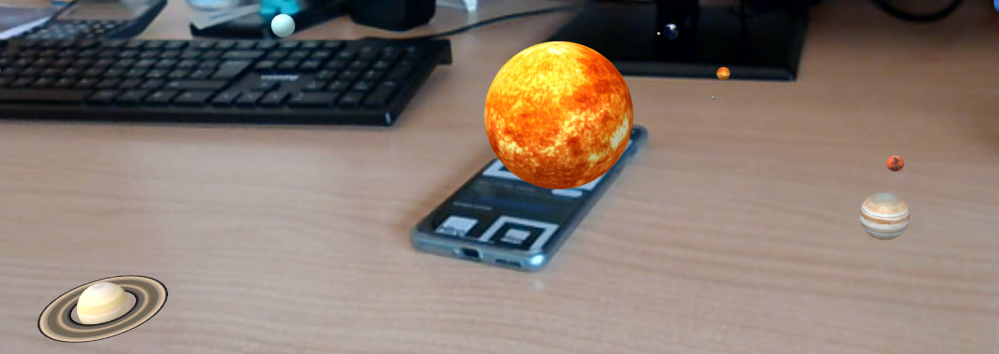
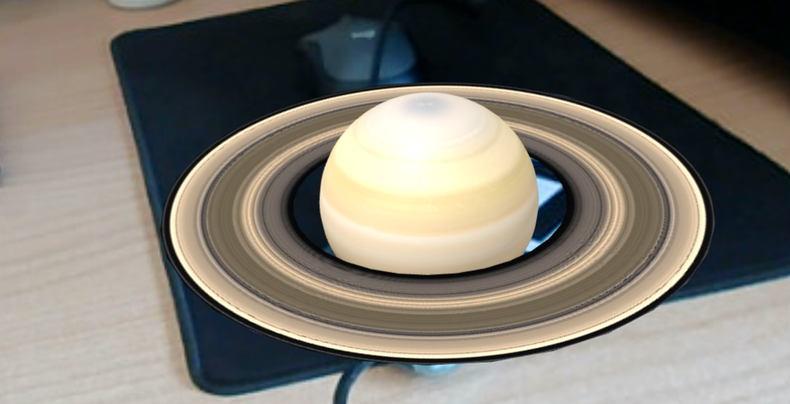
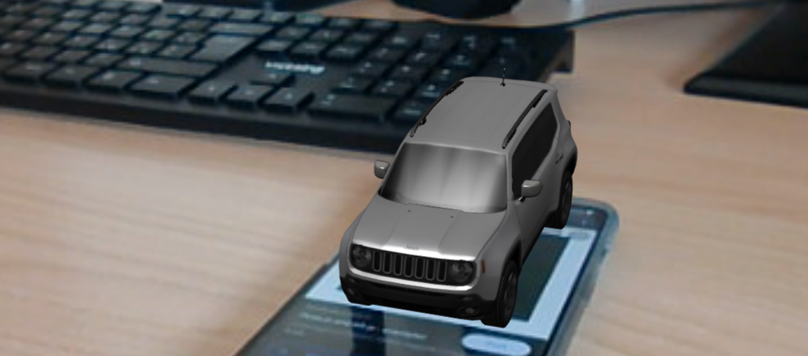

# ARPlanets

A school project with argumented reality, using [AFRAME](https://aframe.io/) and [AR.JS](https://ar-js-org.github.io/AR.js/)
Check the full AR experience by clicking this link: <https://giacomodetomaso.github.io/ARPlanetsAndCars/>

# Marker

You can find the two marker used for this demo inside the "Markers.odt" file (in the root).
The "hiro" marker is used in most of the pages accesible by the menu.
The only page who supports "multi-marker" is the "showroom" which use the "hiro" marker alongisde the "A" marker.

# Preview

Here is a picture of the solar system page (we tried to scale the planets, so they look very small compared with the sun, as it should be): 

Saturn:

And a jeep!: 

# Credits

- AR Code and 3D Models: [**Giacomo Detomaso**](https://github.com/JakDet) and [**Michelangelo De Pascale**](https://github.com/MichelangeloDePascale02)
- Graphics and pages' behavior : [**Gianluigi Palmisano**](https://github.com/Gianlu01k)